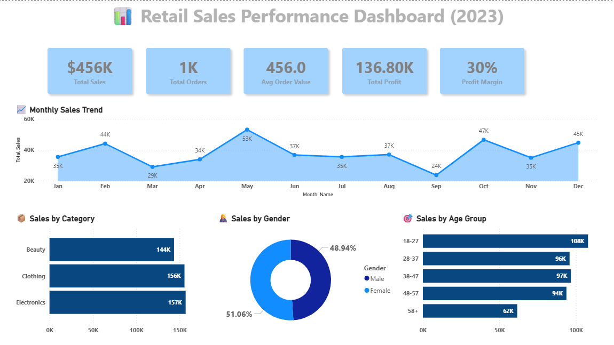
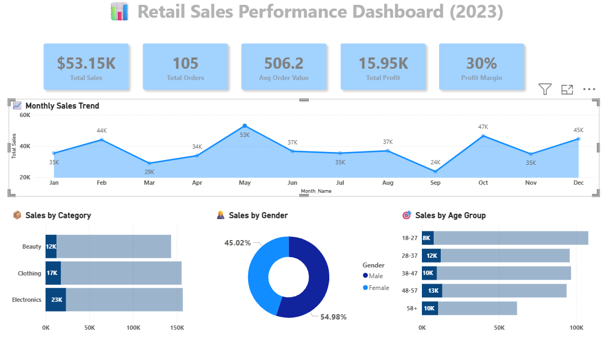
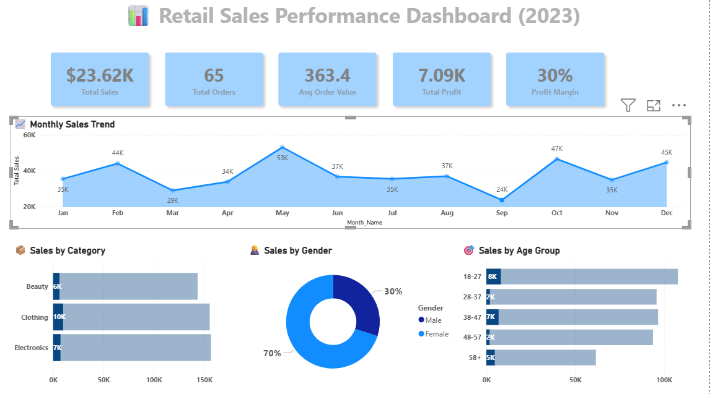

# Retail-Sales-End-to-End-Project


## 📌 Project Overview

This project presents an end-to-end data analytics solution for retail sales data. It demonstrates the full data lifecycle, including data cleaning, transformation, data warehouse design, and interactive dashboard development.

The goal is to analyze sales performance, understand customer behavior, and provide actionable business insights.

---

## 🧠 Business Objective

* Identify key revenue drivers
* Analyze customer segments and purchasing behavior
* Track sales trends over time
* Evaluate product category performance

---

## 🏗️ Project Architecture

The project follows a complete data pipeline:

1. **Data Source** (Excel dataset)
2. **ETL Process (Python)**

   * Data cleaning
   * Feature engineering
   * Data transformation
3. **Data Warehouse (MySQL)**

   * Star Schema design
   * Fact and Dimension tables
4. **Visualization (Power BI)**

   * Interactive dashboard
   * KPI tracking and insights

---

## 🗄️ Data Model (Star Schema)

The data warehouse was designed using a star schema:

* **Fact Table**

  * `fact_sales`

* **Dimension Tables**

  * `dim_customer`
  * `dim_product`
  * `dim_date`

This structure enables efficient querying and scalable reporting.

---

## ⚙️ ETL Process (Python)

The ETL pipeline includes:

* Data cleaning and preprocessing
* Handling missing values and duplicates
* Feature engineering:

  * Age Group segmentation
  * Profit calculation
  * DateKey generation
* Building dimension tables
* Creating fact table
* Loading data into MySQL

---

## 🛠️ Tools & Technologies

* Python (Pandas, SQLAlchemy)
* MySQL
* Power BI
* Excel

---

## 📊 Dashboard Overview



---

## 📈 Peak Sales Month (May)



---

## 📉 Lowest Sales Month (September)



---

## 📊 Key KPIs

* 💰 Total Sales: 456K
* 🧾 Total Orders: 1K
* 📊 Average Order Value: 456
* 💵 Total Profit: 136.8K
* 📈 Profit Margin: 30%

---

## 🔍 Key Insights

* A small group of high-value customers contributes significantly to total revenue
* Customers aged **18–27** represent the most active segment
* **Electronics** is the top-performing category in terms of revenue
* Sales peaked in **May**, indicating possible seasonal demand
* Sales dropped in **September**, suggesting a potential decline in activity

---

## 📁 Project Structure

```
Retail-Sales-End-to-End-Project/
│
├── python/
│   └── etl.py
│
├── sql/
│   └── retail_sales_dw.sql
│
├── powerbi/
│   └── dashboard.pbix
│
├── images/
│   ├── dashboard_all.png
│   ├── dashboard_may.png
│   └── dashboard_sep.png
│
└── README.md
```

---

## 💡 Key Highlights

* Built a complete end-to-end data analytics pipeline
* Designed a star schema data warehouse
* Developed an interactive Power BI dashboard
* Transformed raw data into actionable business insights

